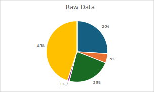
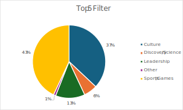
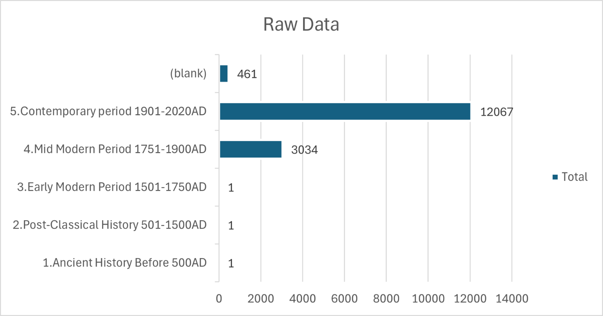
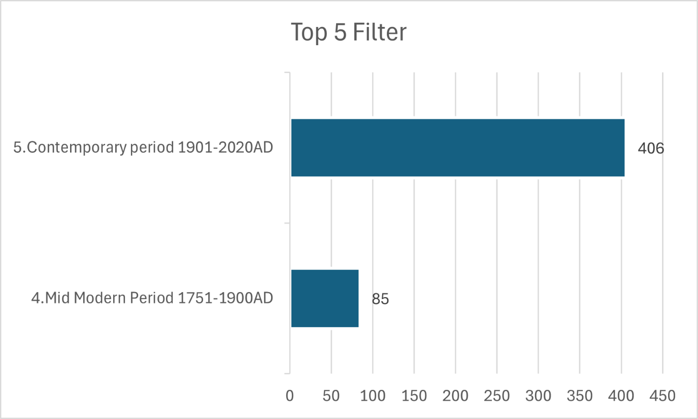

# Notable Ontarians Project: Filter Overview

## Contents
- [Filter](#Filter)
- [Comparison to the Raw Data](#Comparison-to-the-Raw-Data)
  - [People by Category](#People-by-Category)
  - [People by Gender](#People-by-Gender)  
  - [People by Birth Periods](#People-by-Birth-Periods) 
- [Verification of Birthplaces](#Verification-of-Birthplaces)
- [Appendix A](#Appendix-A)
- [Appendix B](#Appendix-B)

---

## Filter

For each Ontario riding, the **top five individuals** with the highest notability index  
(`sum_visib_ln_5criteria`) were selected.

### Rationale

| Rationale                         | Evidence |
|----------------------------------|----------|
| Fair geographical representation | Only 12 ridings have no individuals (see [Appendix A](#Appendix-A)) |
| Manageable sample size           | *n* = 491 (~3% of raw data, *N* = 15,565) |

---

## Comparison to the Raw Data

Overall, the filtered dataset is broadly representative of the raw data across **categories, gender, and birth periods**.

---

### People by Category

**Potential issues identified:**
1. Overrepresentation of people from **Culture**  
   (37% in filtered data vs. 26% in raw data)
2. Underrepresentation of people from **Leadership**  
   (13% in filtered data vs. 23% in raw data)

---

### People by Gender

| Gender | Raw Data (%) | Top 5 Filter (%) |
|-------|--------------|------------------|
| Male   | 82 (n = 12,773) | 80 (n = 392) |
| Female | 18 (n = 2,786)  | 20 (n = 99)  |

---

### People by Birth Periods

Most individuals were born in more recent periods (mid-modern or contemporary).  
The filtered data closely reflects the distribution found in the raw dataset.

---

## Verification of Birthplaces

Five columns were added to the spreadsheet to support birthplace verification:

| Column Name | Explanation |
|------------|-------------|
| `wikipedia` | URL to Wikipedia entry for the dashboard |
| `source` | URL to the verification source |
| `pob mentioned in source` | Place of birth listed in the source |
| `verified?` | **TRUE**: matches raw data **CORRECTED**: edited based on source **BLANK**: unverifiable |
| `notes` | Explanation for unverifiable birthplaces |

### Summary of Results
- Birthplaces for **406 individuals** were verified
- Source quality varied (government websites to unofficial databases)
- **Two serial killers** were removed from the dataset

For **CORRECTED** birthplaces, riding name, ID, and coordinates were updated based on the verified source.  
Geographical coordinates were obtained by:
1. Reusing coordinates from other individuals in the same riding
2. Searching Google Maps (centroid of the area)

### Unverified Individuals
- Birthplaces for **85 individuals** could not be verified due to ambiguous sources  
  (e.g., “Brampton,” which spans multiple ridings)
- Most unverifiable cases fall under **Culture** or **Sports/Games**
- Top occupations among unverifiable individuals:
  - Actors
  - Hockey players
  - Politicians

See [Appendix B](#Appendix-B) for full details.

---

## Appendix A  
### Ridings with Zero Individuals

- Aurora—Oak Ridges—Richmond Hill  
- Brampton East  
- Brampton North  
- Eglinton—Lawrence  
- Etobicoke Centre  
- Hamilton Mountain  
- Mississauga—Erin Mills  
- Oakville North—Burlington  
- Scarborough—Agincourt  
- Scarborough Centre  
- Scarborough Southwest  
- Toronto—Danforth  

---

## Appendix B

### a. Unverifiable Individuals by Riding

| Riding | Count |
|-------|-------|
| Brampton South | 5 |
| Brampton West | 1 |
| Cambridge | 1 |
| Don Valley North | 3 |
| Dufferin—Caledon | 1 |
| Elgin—Middlesex—London | 1 |
| Etobicoke—Lakeshore | 3 |
| Hamilton Centre | 5 |
| Kanata—Carleton | 2 |
| Kitchener Centre | 4 |
| London North Centre | 4 |
| Markham—Stouffville | 3 |
| Mississauga Centre | 5 |
| Mississauga—Lakeshore | 1 |
| Mississauga—Malton | 2 |
| Mississauga—Streetsville | 1 |
| Nipissing | 1 |
| Oshawa | 1 |
| Ottawa Centre | 3 |
| Ottawa West—Nepean | 1 |
| Ottawa—Vanier | 2 |
| Parkdale—High Park | 1 |
| Pickering—Uxbridge | 2 |
| Scarborough North | 3 |
| Scarborough—Guildwood | 4 |
| Scarborough—Rouge Park | 1 |
| Simcoe North | 1 |
| Thornhill | 1 |
| Toronto—St. Paul's | 3 |
| University—Rosedale | 4 |
| Vaughan—Woodbridge | 1 |
| Waterloo | 2 |
| Willowdale | 1 |
| Windsor West | 5 |
| Windsor—Tecumseh | 1 |
| York Centre | 4 |
| York South—Weston | 1 |

---

### b. Unverifiable Individuals by Category

| Category | Count |
|---------|-------|
| Culture | 44 |
| Discovery/Science | 1 |
| Leadership | 10 |
| Other | 1 |
| Sports/Games | 29 |
